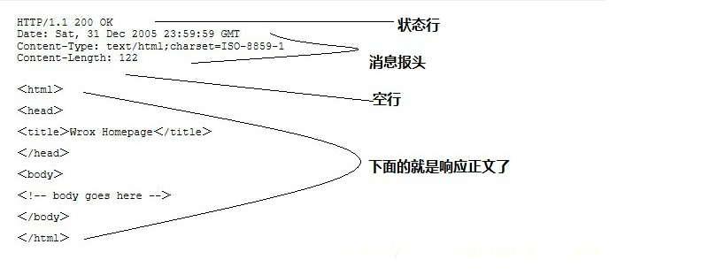

http连接处理类
===============
### 大致工作
根据状态转移,通过主从状态机封装了http连接类。其中，从状态机负责读取报文的一行，主状态机负责对该行数据进行解析，主状态机内部调用从状态机，从状态机驱动主状态机。
> * 客户端发出http连接请求
> * 从状态机读取数据,更新自身状态和接收数据,传给主状态机
> * 主状态机根据从状态机状态,更新自身状态,决定响应请求还是继续读取

---------------------------------------
### 解析报文整体流程
`process_read` 通过 `while` 循环，将主从状态机进行封装，对报文的每一行进行循环处理。
> 判断条件
>* 主状态机转移到CHECK_STATE_CONTENT，该条件涉及解析消息体
>* 从状态机转移到LINE_OK，该条件涉及解析请求行和请求头部
>* 两者为或关系，当条件为真则继续循环，否则退出

> 循环体
>* 从状态机读取数据
>* 调用get_line函数，通过m_start_line将从状态机读取数据间接赋给text
>* 主状态机解析text

### [状态机详解](https://blog.csdn.net/qq_34039018/article/details/103603932)

---------------------------------------
### http报文
#### 报文格式：
\

#### 响应报文：

---------------------------------------
### m_urld 解析情况
m_url为请求报文中解析出的请求资源，以 `/` 开头，也就是 `/xxx` ，项目中解析后的 m_url 有 `8` 种情况。

>* / 
>>* GET请求，跳转到judge.html，即欢迎访问页面
>* /0
>>* POST请求，跳转到register.html，即注册页面
>* /1
>>* POST请求，跳转到log.html，即登录页面
>* /2 CGISQL.cgi
>>* POST请求，进行登录校验
>>* 验证成功跳转到welcome.html，即资源请求成功页面
>>* 验证失败跳转到logError.html，即登录失败页面
>* /3 CGISQL.cgi
>>* POST请求，进行注册校验
>>* 注册成功跳转到log.html，即登录页面
>>* 注册失败跳转到registerError.html，即注册失败页面
>* /5
>>* POST请求，跳转到picture.html，即图片请求页面
>* /6
>>* POST请求，跳转到video.html，即视频请求页面
>* /7
>>* POST请求，跳转到fans.html，即关注页面
